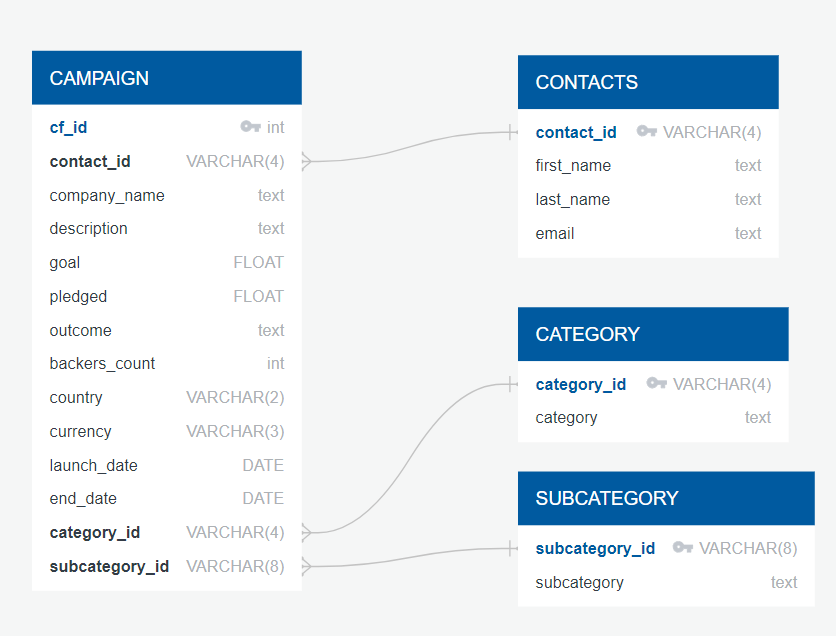

# Crowdfunding_ETL
An ETL (extract, transform, & load) pipeline using Python, Pandas, and Python dictionary methods.

The structure of the repository should be:
```
sqlalchemy-challenge
├── Resources       <- raw data
│   ├── contacts.xlsx
│   └── crowdfunding.xlsx  
├── crowdfunding_db_schema.sql              <- database schema
├── ETL_Mini_Project_DNinalga.ipynb         <- ETL ntoebook
├── campaign.csv         <- campaign junction table
├── category.csv         <- category information table
├── subcategory.csv      <- subcategory information table  
├── contacts.csv         <- contact information table
├── erd.png         <- an ERD sketch of the tables
├── LICENSE         <- MIT
└── README.md       <- this
```
